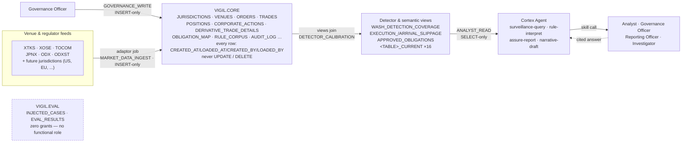

# Vigil

**A citation-backed regulatory reporting and market-surveillance copilot for exchanges and
trading venues, built natively on Snowflake Cortex.**

Vigil turns raw order/trade/position data into surveillance findings, timeliness and best-execution
metrics, and regulator-ready reports — every finding traceable back to the specific rule text that
requires it, and every write path governed by role-based access control instead of application-layer
trust.

## Why Vigil

Regulatory surveillance systems are usually built for one market and retrofitted for others later,
which is where hardcoded currencies, market codes, and thresholds tend to creep in. Vigil is built
**market-agnostic from the first line of schema**: every detector reads its thresholds from a
calibration table scoped by jurisdiction, not a literal in the query, so extending coverage to a new
regulator is a data problem, not a code change.

## Core capabilities

| Obligation type | What it covers |
|---|---|
| **Trade surveillance** | Wash trading, spoofing/layering, and abnormal volume/price detection over order and trade event streams |
| **Position & exposure limits** | Concentration of a position in an instrument against a regulatory threshold, corporate-action-adjusted (`CORPORATE_ACTIONS`) |
| **Transaction reporting** | Timeliness, completeness, and field-level accuracy of trade reports submitted to a regulator — including OTC derivatives (`DERIVATIVE_PRODUCT_ATTRIBUTES`/`DERIVATIVE_TRADE_DETAILS`) and a field list sourced from the actual EU RTS 22 regulation text |
| **Best execution** | Execution price vs. reference price, order-routing quality |

Findings and reports are grounded in real rule text — a governed corpus of regulatory citations
(`RULE_CORPUS`) is mapped to obligations and report fields, so the agent can answer *why* a
requirement exists, not just *whether* it was met.

## Live demo

The Streamlit dashboard runs as a Streamlit-in-Snowflake app inside this project's own Snowflake
account (`VIGIL.CORE.VIGIL_DASHBOARD`) — a workflow-stage view plus a persona switcher (Analyst,
Governance Officer, Reporting Officer, Compliance Officer, Investigator) that performs real,
RBAC-enforced write actions (propose/approve an obligation, log a surveillance run, render a
report payload, record a sign-off) by switching the session's actual Snowflake role, not by
simulating them in the UI:

**https://app.snowflake.com/sbobpmm/yb05177/#/streamlit-apps/VIGIL.CORE.VIGIL_DASHBOARD**

This is a Snowsight URL, not a public web app — opening it requires logging into this Snowflake
account with a role that has `USAGE` on the app (`ANALYST_READ` already does). It isn't a
self-service signup; ask for access if you need to view it and aren't already a user on the
account. The agent itself is also directly callable via
`SNOWFLAKE.CORTEX.DATA_AGENT_RUN` on `VIGIL.CORE.VIGIL_SURVEILLANCE_AGENT` for anyone with a
Snowflake worksheet and `ANALYST_READ`.

## Architecture

One insert-only gate per write path into `VIGIL.CORE`; every read out is a view, never a base
table, for anyone but `GOVERNANCE_WRITE` itself. `VIGIL.EVAL` has no arrow reaching it — isolation
here means no grant statement exists, not a policy someone has to remember.



- **Schema** — one canonical data model shared by all four obligation types, scoped by
  `JURISDICTION_ID` (regulator) and `VENUE_ID` (exchange/PTS), append-only with explicit
  milestoning — no table is ever `UPDATE`d or `DELETE`d in place. 21 base tables, 16 `_CURRENT`
  views plus `APPROVED_OBLIGATIONS`/`REPORT_TEMPLATE_COVERAGE`/`WASH_DETECTION_COVERAGE`.
- **RBAC** — five functional roles (`MARKET_DATA_INGEST`, `ANALYST_READ`, `GOVERNANCE_WRITE`,
  `AUDIT_INSERT`, `OFFICER_SIGNOFF`) plus `VIGIL_AUTOMATION`, a scoped automation role covering
  exactly the four non-signoff roles for programmatic execution; none of them hold write access
  beyond their documented boundary. `SP_RECORD_SIGNOFF` binds `SIGNOFF_BY` to `CURRENT_USER()`
  server-side, so a caller holding `OFFICER_SIGNOFF` cannot assert a fabricated identity.
- **Detectors** — SQL views joined against a per-jurisdiction `DETECTOR_CALIBRATION` table, so
  thresholds are configuration, not code; the most specific matching calibration row wins over a
  more lenient fallback.
- **Governance gate** — new obligations and report-template mappings move through a
  proposed → approved workflow (`SP_PROPOSE_OBLIGATION`/`SP_APPROVE_OBLIGATION`) validated against
  live `INFORMATION_SCHEMA`, not just inserted.
- **Agent layer** — a Snowflake Cortex Agent (`VIGIL_SURVEILLANCE_AGENT`) backed by four skills
  (surveillance querying, rule interpretation, narrative drafting, report assurance) and a
  scheduled audit trail of every surveillance run (`SURVEILLANCE_RUN_LOG`, `SIGNOFF_LOG`,
  `DOCUMENTED_FINDINGS_LOG` — narrow views over an otherwise unreadable append-only `AUDIT_LOG`).

Full data model, RBAC matrix, detector design, and build order: [`architecture.md`](architecture.md).
Column-level reference for every table/view: [`docs/data_dictionary.md`](docs/data_dictionary.md).
More diagrams (data model, milestoning, ingestion/detection sequence, governance-gate sequence,
per-role flows): [`docs/system_diagrams.md`](docs/system_diagrams.md).

## Tech stack

| Layer | Technology |
|---|---|
| Data platform | Snowflake (native SQL, no migration tool) |
| AI/agent layer | Snowflake Cortex — Cortex Agents, Cortex Search |
| Language | Python 3.12 |
| Demo UI | Streamlit-in-Snowflake |
| Testing | pytest |

## Repository structure

```
sql/
  ddl/              Schema (reference data, orders, trades, positions, reports, governance, audit)
  rbac/             Role and grant scripts
  detectors/        Detector views + ZSCORE UDF
  semantic_views/   Semantic Views backing the Cortex Agent
  procedures/       Governed stored procedures (sign-off, report rendering, audit logging)
  governance/       Seeded rule corpus / obligation mappings
generator/          Synthetic data generator + Snowflake loader, per-jurisdiction config
skills/             Agent skills (surveillance query, rule interpretation, narrative draft, report assurance)
cortex_project/     Cortex Agent definition + live routing regression suite
ui/                 Streamlit dashboard
notebooks/          Demo walkthrough
docs/               Schema contract, data dictionary, workflow query reference, diagrams
scripts/            Operational scripts (SQL runner, RBAC verification, restatement)
tests/              pytest suite (generator, skills, report adaptor)
```

## Getting started

Python tooling runs from a `.venv` built with Homebrew's `python@3.12` (the system Python can't
build `snowflake-connector-python` from source).

```bash
# Connectivity check
.venv/bin/python3 scripts/run_sql.py --check

# Run SQL file(s) against VIGIL.CORE (as the configured SNOWFLAKE_ROLE, e.g. VIGIL_AUTOMATION)
.venv/bin/python3 scripts/run_sql.py sql/ddl/00_setup.sql

# Actual DDL/RBAC/grant changes run as ACCOUNTADMIN, not the routine automation role
.venv/bin/python3 scripts/run_sql.py --admin sql/rbac/07_vigil_automation_role.sql

# Live RBAC verification (positive + negative checks per role)
.venv/bin/python3 scripts/verify_rbac.py

# Run the test suite (generator, skills, report adaptor — no Snowflake connection required)
.venv/bin/python3 -m pytest

# Generate synthetic data in-memory
.venv/bin/python3 -c "from generator.generate import generate; from generator.jurisdiction_config import JAPAN_CONFIG"

# Load synthetic data into Snowflake
.venv/bin/python3 generator/load_to_snowflake.py
```

Connection config (account/user/role/warehouse/private-key path) is read from a local, gitignored
`.env` file; the private key itself is kept outside the repository entirely, in `~/.snowflake/`.

### Redeploying the Streamlit dashboard

`ui/streamlit_app.py` runs inside Snowflake off a staged copy of the file — editing it locally has
no effect on the live app (see [Live demo](#live-demo)) until the stage is refreshed:

```sql
PUT file:///absolute/path/to/ui/streamlit_app.py @VIGIL.CORE.DEMO_STAGE AUTO_COMPRESS=FALSE OVERWRITE=TRUE;
```

Run via `scripts/run_sql.py --admin` (a one-off `.sql` file, or any script that opens a connection
with `connect(admin=True)` and calls `cur.execute(...)` directly — `PUT` isn't a plain SQL string
in a multi-statement file, so it needs its own cursor call rather than `run_file()`). The
`CREATE STREAMLIT` object itself (`ROOT_LOCATION`/`MAIN_FILE`) only needs to be created once; after
that, only the stage file needs refreshing per change.

## Status

All build-order phases are complete for the first jurisdiction, Japan (`JURISDICTION_ID = 'JP'`):
schema, RBAC, detectors, semantic views, agent + skills, synthetic data, and a demo layer, along
with a scheduled audit trail and a documented-findings pipeline. Coverage since the initial build
extends to corporate actions and OTC derivatives reporting for JP, and a real RTS 22 field-list
extension for EU sourced from the actual Commission Delegated Regulation 2017/590 text
(`docs/sources/`). The project has been through several rounds of adversarial review — see
[`NOTES.md`](NOTES.md) for the full, dated history — covering least-privilege execution, structural
(not prompt-only) agent-honesty guarantees, identity-binding on sign-off, and deeper audit-trail
coverage (including a `SIGNOFF_LOG` view closing a gap where `OFFICER_SIGNOFF` could write but
never read its own audit trail).

**Known limitations:**

- Japan, US, and EU all have synthetic trade data loaded and live-verified (`TRADES`: JP 903, EU
  885, US 884) — every detector view returns real, non-trivial findings for all three (see
  `NOTES.md`, "Gap 10 CLOSED", 2026-09-15). Japan remains the only jurisdiction with a *complete*
  config end to end (full report-template field coverage, OTC-derivatives model); US/EU prove the
  market-agnostic mechanism but haven't had the same report-format/OTC-derivatives depth applied.
- Field-level report-format citations are sourced for the EU but not yet for Japan.
- SQL-layer correctness (RBAC, detectors, schema conformance) is verified manually against a live
  Snowflake session and logged in `NOTES.md`, not yet covered by automated tests. The Python-only
  layers (generator, skills, report adaptor) have full pytest coverage.
- The Streamlit dashboard (`VIGIL.CORE.VIGIL_DASHBOARD`) is deployed from a manually-staged file
  copy, not a CI/CD pipeline — see "Redeploying the Streamlit dashboard" above; a code change with
  no matching redeploy silently leaves the live app stale, which happened once already (caught and
  fixed 2026-09-16, see `NOTES.md`).
