# System &amp; flow diagrams

Companion to `architecture.md` and `docs/canonical_schema_contract.md` (v7) — the mechanism behind the data model, the milestoning guarantee, and how each role moves through the system. Diagrams are Mermaid, rendered natively by GitHub/most Markdown viewers; column-level detail and the full FIX-by-FIX rationale live in the two docs above, not here.

## 1. System architecture

One insert-only gate per write path into `VIGIL.CORE`; every read out is a view, never a base table, for anyone but `GOVERNANCE_WRITE` itself. `VIGIL.EVAL` has no arrow reaching it — isolation here means no grant statement exists, not a policy someone has to remember.

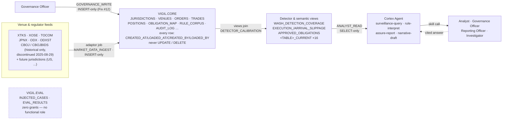

## 2. Data model

Two chains share `JURISDICTION_ID`: the market-data chain (who traded what, where) and the governance chain (what obligation applies, backed by which rule text). `POSITIONS` only ever derives from `TRADES` — the arrow from `ORDERS` a v2 draft once drew was a real diagram bug (Fix #4), not a simplification.

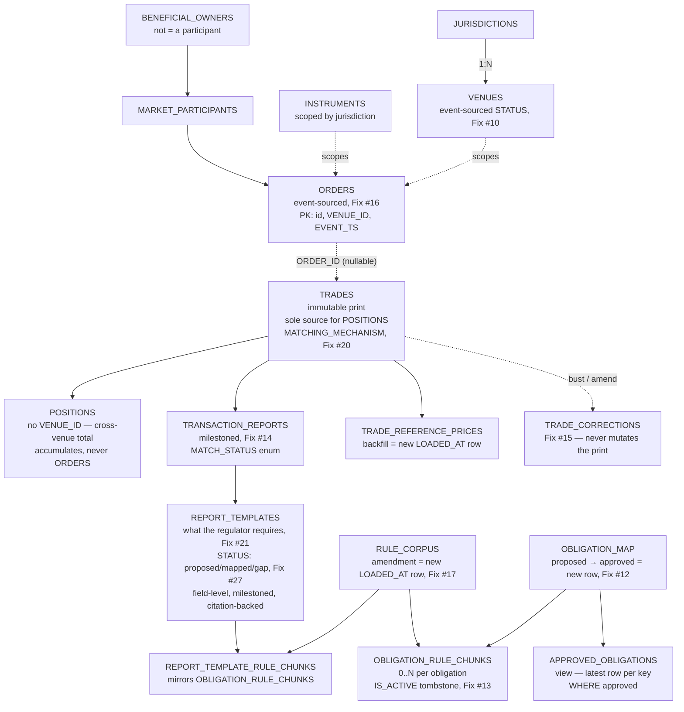

A required field with no current source is `STATUS = 'gap'` — a deliberate, non-blocking state (Fix #28), not an error or a silent omission. `REPORT_TEMPLATE_COVERAGE` surfaces which fields are `gap` per (`JURISDICTION_ID`, `REPORT_TYPE`), the same "surfaced, not hidden" role `WASH_DETECTION_COVERAGE` plays for wash trading.

Every box above is milestoned identically (`CREATED_AT`/`CREATED_BY`/`LOADED_AT`/`LOADED_BY`, latest-row `_CURRENT` view) — that fact is stated once here rather than sixteen times; the labels called out per box are the ways each table's write pattern differs from the uniform rule.

## 3. The milestoning guarantee

The mechanism, traced through one real row: the `VENUES` row for `CBOJ` (Cboe Japan) going from active to discontinued. Three physical rows exist for the same `VENUE_ID`; none was ever touched after it was written.

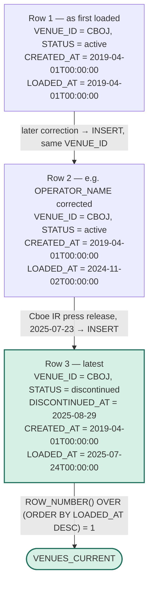

**Never granted, any role:** `UPDATE`, `DELETE`. **Always, every table:** `INSERT`. `CREATED_AT` stays fixed across every version of the row; `LOADED_AT` is what a reader orders by. No SQL grant script in `sql/rbac/` issues `UPDATE` or `DELETE` against any table — the guarantee is structural, not a review checklist.

**What this closes (v5, Fix #10–#19):** before this pass, only `POSITIONS` and `DETECTOR_CALIBRATION` actually worked this way. `OBLIGATION_MAP`'s proposed→approved flip was an explicit `UPDATE` grant; `ORDERS`' `MODIFIED_TS`/`CANCELLED_TS` assumed a mutation path no role was ever given. Both are fixed structurally, not documented as known gaps.

## 4. Ingestion &amp; detection

No detector reads a literal threshold; every one joins `DETECTOR_CALIBRATION`. Wash-trading findings never travel alone — `WASH_DETECTION_COVERAGE` rides along so "no wash trades found" and "no wash trades could be checked for" are never the same sentence.

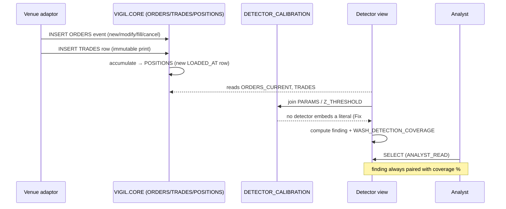

The only mutable-looking step is the self-loop on `VIGIL.CORE` — and even that is an `INSERT` into `POSITIONS` with a later `LOADED_AT`, never an update to the prior snapshot.

## 5. Governance gate

The gate used to be a policy: "query `OBLIGATION_MAP` and refuse an unapproved row." It's now structural on two axes — `APPROVED_OBLIGATIONS` is the only lookup surface granted to a reader (Fix #6), and approval itself can no longer overwrite the record of when something was proposed (Fix #12).

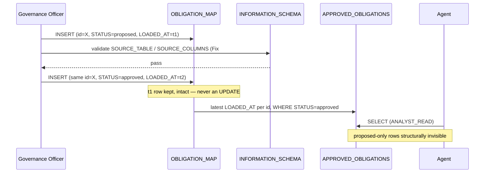

The obligation's full history — proposed at `t1`, approved at `t2` — survives in two rows. A future `revoked` status is a third row and a third timestamp, not a lost second one.

## 6. User flows

Every flow below bottoms out in the same place: a `VIGIL.CORE` read through a view, or a governed write through an insert-only grant. What differs is which skill mediates it.

**Compliance Analyst — `surveillance-query`**

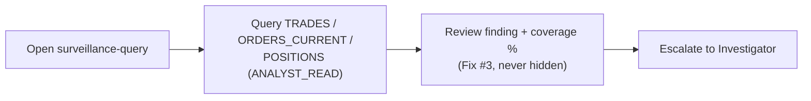

**Governance Officer — `rule-interpret`**

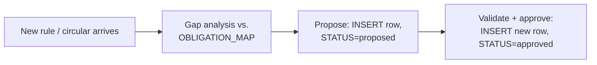

**Reporting Officer — `assure-report`**

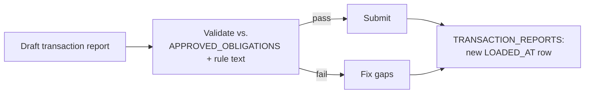

**Investigator — `narrative-draft`**

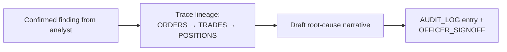

## 7. RBAC matrix

Every non-empty cell below is `INSERT` or `SELECT`. There is no `UPDATE`/`DELETE` column because no role holds either, on anything, anywhere in `VIGIL.CORE`.

| Role | Market-data tables (`JURISDICTIONS`…`TRANSACTION_REPORTS`) | `OBLIGATION_MAP` (base) | `APPROVED_OBLIGATIONS` (view) | `OBLIGATION_RULE_CHUNKS` | `RULE_CORPUS` | `REPORT_TEMPLATES` / `_RULE_CHUNKS` | `REPORT_TEMPLATE_COVERAGE` (view) | `AUDIT_LOG` | `VIGIL.EVAL` |
|---|---|---|---|---|---|---|---|---|---|
| `ANALYST_READ` | SELECT | — | SELECT | — | SELECT | — | SELECT | — | — |
| `GOVERNANCE_WRITE` | — | INSERT + SELECT | inherits, not granted directly | INSERT | INSERT | INSERT | — | — | — |
| `AUDIT_INSERT` | — | — | — | — | — | — | — | INSERT (no SELECT) | — |
| `OFFICER_SIGNOFF` | `SP_RECORD_SIGNOFF` only — no direct table grants anywhere | | | | | | | | — |
| `MARKET_DATA_INGEST` | INSERT (incl. `ORDERS`, `TRADES`, `TRADE_CORRECTIONS`) | — | — | — | — | SELECT on `REPORT_TEMPLATES_CURRENT` only | — | — | — |

**No role, anywhere, is ever granted `UPDATE` or `DELETE`** (Fix #18) — `OBLIGATION_MAP`'s grant above was the last one that did, closed in the same v5 pass that added milestoning everywhere else. `MARKET_DATA_INGEST`'s `SELECT` on `REPORT_TEMPLATES_CURRENT` (Fix #21, v6) is its only read grant anywhere — needed to know which fields a report requires before generating one, still no base-table read access. A `STATUS = 'gap'` transition (Fix #27, v7) is written by `GOVERNANCE_WRITE`'s existing `INSERT`-only grant — no new role or grant needed for a required field to be honestly marked unsourceable. `ANALYST_READ`'s `SELECT` on `REPORT_TEMPLATE_COVERAGE` (Fix #28, v7) is the same grant category as its existing `WASH_DETECTION_COVERAGE` access — without it, `rule-interpret`/`assure-report` would have no role able to run the completeness-companion query.

## 8. Surveillance audit trail (built via Snowflake CoCo CLI, 2026-09-14)

Added after the diagrams above, as a demo-layer pipeline turning a detector view's live result into a persisted, queryable audit row — closing a gap that existed since Phase 2/6 (`AUDIT_LOG` was RBAC-governed and read by `narrative-draft`, but nothing had ever written a real row to it). Full build/review log in `TRACKER.md`/`NOTES.md`.

### 8.1 Current architecture

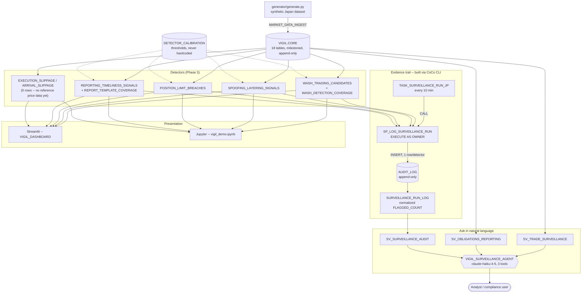

### 8.2 Signal → evidence → documented finding: coverage vs. the gap

`SP_LOG_SURVEILLANCE_RUN` covers 3 of Vigil's 4 obligation types (trade surveillance, position limits, post-trade reporting timeliness) end to end. Best execution was never wired in, and even where the pipeline is complete, it stops at a queryable count -- it does not yet produce an actual filed report or assurance verdict as the "documented finding."

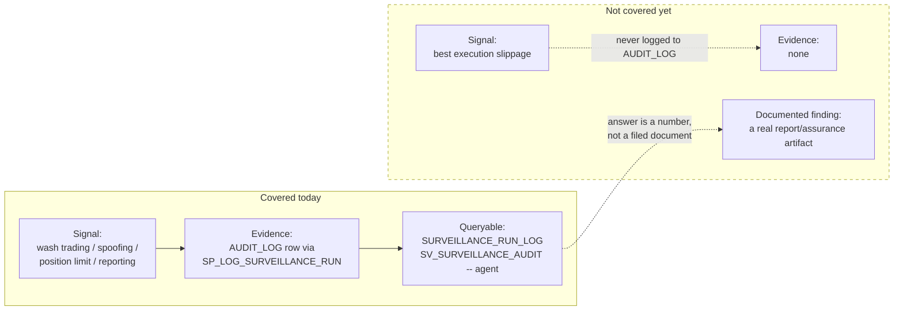

### 8.3 Scheduled run -- exact call sequence

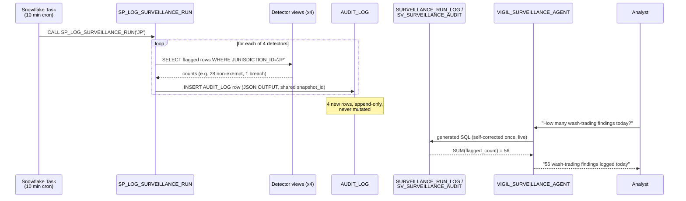

## 9. The other three product skills

Section 8 only diagrams `surveillance-query`'s path (the one skill that fits the chat-agent tool-call model). The other three are directly-callable Python/CLI skills doing bespoke multi-step orchestration, per architecture.md's own decision rule -- none of them have ever been diagrammed until now.

### 9.1 `rule-interpret` — gap analysis

`find_gaps()` is the mechanism only -- `required_concepts` is caller-supplied (an analyst's or a future NLP step's reading of a rule chunk), not derived from real FSA/SESC text yet (architecture.md's "What's explicitly deferred").

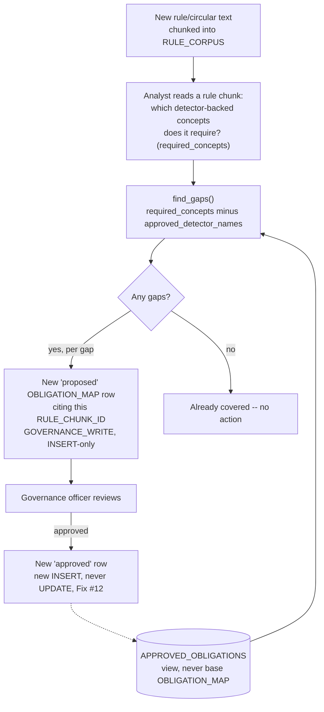

### 9.2 `assure-report` — pre-submission assurance verdict

Wraps `ingest/report_adaptor.py` (section 10 below) rather than reimplementing it -- this skill's job is turning a `MappingResult` into a verdict an analyst can act on.

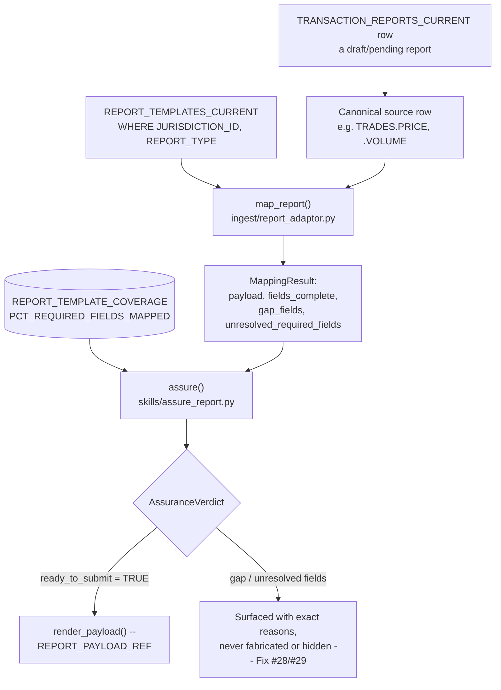

### 9.3 `narrative-draft` — lineage & remediation narrative

A pure graph walk over caller-supplied `AUDIT_LOG` rows -- no query logic, no LLM fabrication. Every fact in the output traces to a row in the chain.

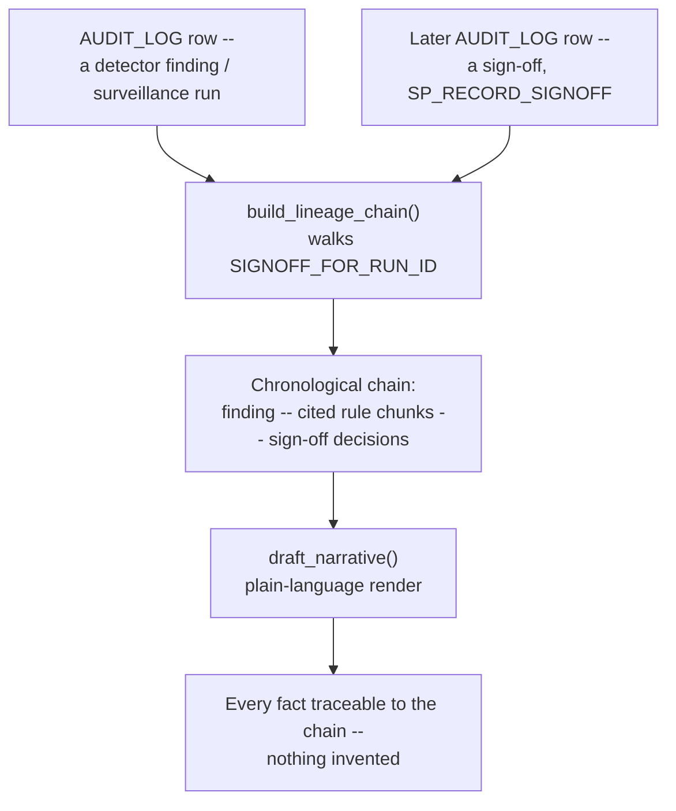

## 10. Report generation / adaptor (`ingest/report_adaptor.py`)

Python, not SQL -- architecture.md's build order explicitly separates this from the Semantic Views. `STATUS` on each `REPORT_TEMPLATES_CURRENT` field drives three different outcomes per field, not one blanket rule.

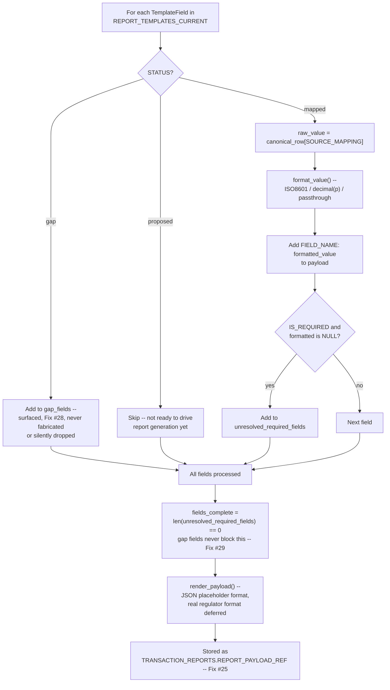

## 11. CoCo demo-video phase map

Maps the hackathon's four required phases onto what actually happened and which tool did it -- for structuring the recording, not a system diagram. Full detail in `TRACKER.md`/`NOTES.md`.

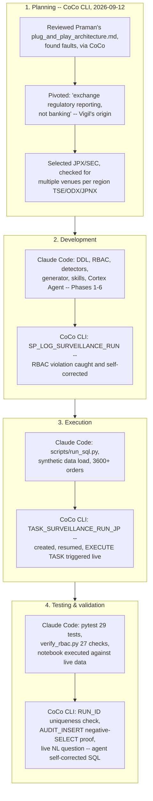

Where to find the Planning-phase evidence for the recording: `~/.snowflake/cortex/history`, timestamped `2026-09-12`, in the sibling `Praman` repo directory (not this one) -- it predates this project's own git history entirely.
