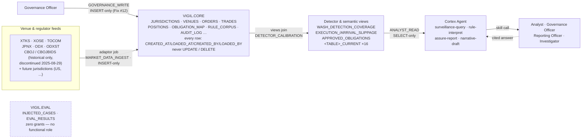
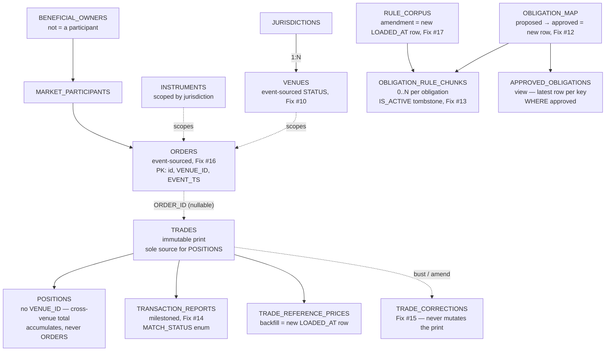
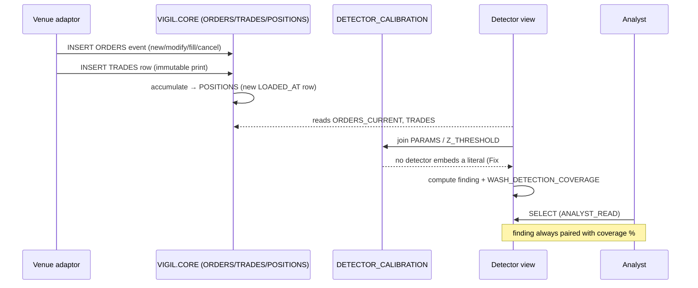
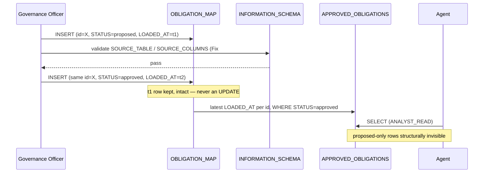
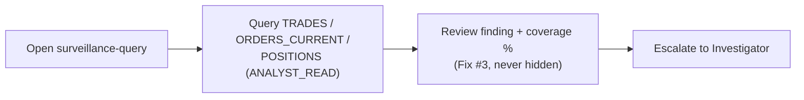
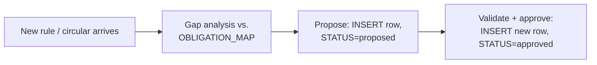
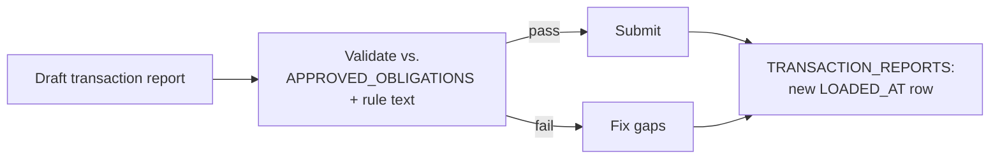
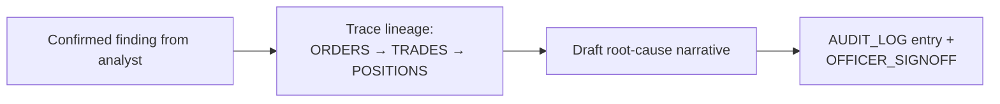

# System &amp; flow diagrams

Companion to `architecture.md` and `docs/canonical_schema_contract.md` (v5) — the mechanism behind the data model, the milestoning guarantee, and how each role moves through the system. Diagrams are Mermaid, rendered natively by GitHub/most Markdown viewers; column-level detail and the full FIX-by-FIX rationale live in the two docs above, not here.

## 1. System architecture

One insert-only gate per write path into `VIGIL.CORE`; every read out is a view, never a base table, for anyone but `GOVERNANCE_WRITE` itself. `VIGIL.EVAL` has no arrow reaching it — isolation here means no grant statement exists, not a policy someone has to remember.

## 2. Data model

Two chains share `JURISDICTION_ID`: the market-data chain (who traded what, where) and the governance chain (what obligation applies, backed by which rule text). `POSITIONS` only ever derives from `TRADES` — the arrow from `ORDERS` a v2 draft once drew was a real diagram bug (Fix #4), not a simplification.

Every box above is milestoned identically (`CREATED_AT`/`CREATED_BY`/`LOADED_AT`/`LOADED_BY`, latest-row `_CURRENT` view) — that fact is stated once here rather than sixteen times; the labels called out per box are the ways each table's write pattern differs from the uniform rule.

## 3. The milestoning guarantee

The mechanism, traced through one real row: the `VENUES` row for `CBOJ` (Cboe Japan) going from active to discontinued. Three physical rows exist for the same `VENUE_ID`; none was ever touched after it was written.

**Never granted, any role:** `UPDATE`, `DELETE`. **Always, every table:** `INSERT`. `CREATED_AT` stays fixed across every version of the row; `LOADED_AT` is what a reader orders by. No SQL grant script in `sql/rbac/` issues `UPDATE` or `DELETE` against any table — the guarantee is structural, not a review checklist.

**What this closes (v5, Fix #10–#19):** before this pass, only `POSITIONS` and `DETECTOR_CALIBRATION` actually worked this way. `OBLIGATION_MAP`'s proposed→approved flip was an explicit `UPDATE` grant; `ORDERS`' `MODIFIED_TS`/`CANCELLED_TS` assumed a mutation path no role was ever given. Both are fixed structurally, not documented as known gaps.

## 4. Ingestion &amp; detection

No detector reads a literal threshold; every one joins `DETECTOR_CALIBRATION`. Wash-trading findings never travel alone — `WASH_DETECTION_COVERAGE` rides along so "no wash trades found" and "no wash trades could be checked for" are never the same sentence.

The only mutable-looking step is the self-loop on `VIGIL.CORE` — and even that is an `INSERT` into `POSITIONS` with a later `LOADED_AT`, never an update to the prior snapshot.

## 5. Governance gate

The gate used to be a policy: "query `OBLIGATION_MAP` and refuse an unapproved row." It's now structural on two axes — `APPROVED_OBLIGATIONS` is the only lookup surface granted to a reader (Fix #6), and approval itself can no longer overwrite the record of when something was proposed (Fix #12).

The obligation's full history — proposed at `t1`, approved at `t2` — survives in two rows. A future `revoked` status is a third row and a third timestamp, not a lost second one.

## 6. User flows

Every flow below bottoms out in the same place: a `VIGIL.CORE` read through a view, or a governed write through an insert-only grant. What differs is which skill mediates it.

**Compliance Analyst — `surveillance-query`**

**Governance Officer — `rule-interpret`**

**Reporting Officer — `assure-report`**

**Investigator — `narrative-draft`**

## 7. RBAC matrix

Every non-empty cell below is `INSERT` or `SELECT`. There is no `UPDATE`/`DELETE` column because no role holds either, on anything, anywhere in `VIGIL.CORE`.

| Role | Market-data tables (`JURISDICTIONS`…`TRANSACTION_REPORTS`) | `OBLIGATION_MAP` (base) | `APPROVED_OBLIGATIONS` (view) | `OBLIGATION_RULE_CHUNKS` | `RULE_CORPUS` | `AUDIT_LOG` | `VIGIL.EVAL` |
|---|---|---|---|---|---|---|---|
| `ANALYST_READ` | SELECT | — | SELECT | — | SELECT | — | — |
| `GOVERNANCE_WRITE` | — | INSERT + SELECT | inherits, not granted directly | INSERT | INSERT | — | — |
| `AUDIT_INSERT` | — | — | — | — | — | INSERT (no SELECT) | — |
| `OFFICER_SIGNOFF` | `SP_RECORD_SIGNOFF` only — no direct table grants anywhere | | | | | | — |
| `MARKET_DATA_INGEST` | INSERT (incl. `ORDERS`, `TRADES`, `TRADE_CORRECTIONS`) | — | — | — | — | — | — |

**No role, anywhere, is ever granted `UPDATE` or `DELETE`** (Fix #18) — `OBLIGATION_MAP`'s grant above was the last one that did, closed in the same v5 pass that added milestoning everywhere else.
